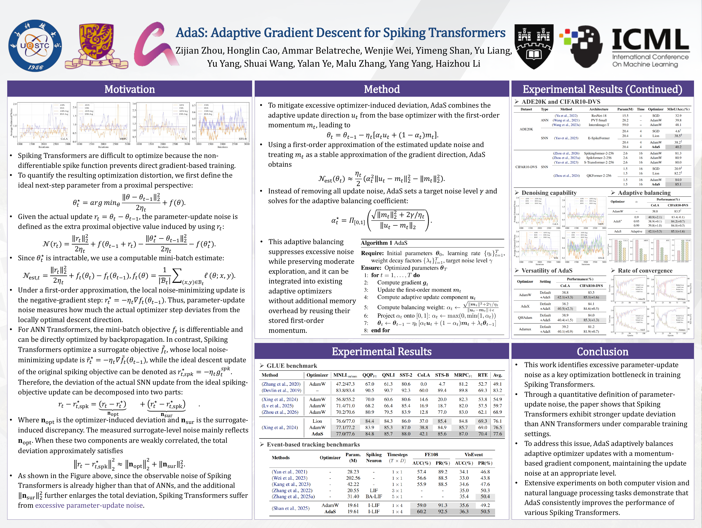

<div align="center">

<h1>AdaS: Adaptive Gradient Descent for Spiking Transformers</h1>

<p>
  Zijian Zhou, Honglin Cao, Ammar Belatreche, Wenjie Wei, Yimeng Shan, Yu Liang,<br>
  Yu Yang, Shuai Wang, Yalan Ye, Malu Zhang, Yang Yang, Haizhou Li
</p>

<p><strong>ICML 2026</strong></p>

<p>
  <a href="https://proceedings.mlr.press/v306/zhou26d.html"></a>
  <a href="https://raw.githubusercontent.com/mlresearch/v306/main/assets/zhou26d/zhou26d.pdf"></a>
  <a href="https://openreview.net/forum?id=iQjyBjSDFp"></a>
  <a href="assets/AdaS_ICML2026_poster.pdf"></a>
  <a href="https://github.com/CayleyZ/AdaS/releases"></a>
</p>

<p>Official PyTorch implementation of <strong>AdaS</strong>, an optimizer for Spiking Transformers.</p>

</div>

## News

- Our paper is published in the [ICML 2026 proceedings](https://proceedings.mlr.press/v306/zhou26d.html).
- Training code for GLUE, CIFAR10-DVS, and ADE20K, together with the required pretrained checkpoints, is available in this repository and [GitHub Releases](https://github.com/CayleyZ/AdaS/releases).

## Overview

**AdaS** addresses excessive **parameter-update noise** in Spiking Transformer training. Surrogate-gradient learning introduces a discrepancy from the original spiking objective, while adaptive optimization can further amplify update deviation. AdaS controls the optimizer-induced component by balancing an adaptive update direction with a momentum-based gradient direction.

The method has three key ingredients:

- **Quantifying update noise.** A proximal-objective formulation measures how far the actual parameter update deviates from the locally optimal descent step.
- **Adaptive noise control.** A balancing coefficient is computed from the target noise level `gamma`, reducing excessive noise while retaining moderate exploration.
- **Reusing optimizer state.** AdaS uses the first-order momentum already stored by the base adaptive optimizer, requiring no additional momentum buffer.

Ignoring weight decay, the update takes the form

$$
\theta_t = \theta_{t-1} - \eta_t\left[\alpha_t u_t + (1-\alpha_t)m_t\right],
$$

where $u_t$ is the adaptive update direction, $m_t$ is the first-order momentum, and $\alpha_t \in [0,1]$ balances the two components.

[](assets/AdaS_ICML2026_poster.pdf)

<p align="center"><a href="assets/AdaS_ICML2026_poster.pdf">View the full-resolution poster (PDF)</a></p>

## Main Results on GLUE

Results with **SpikeLM** on the GLUE benchmark:

| Optimizer | MNLI (m/mm) | QQP (F1) | QNLI | SST-2 | CoLA | STS-B | MRPC (F1) | RTE | Avg. |
| :--- | :---: | :---: | :---: | :---: | :---: | :---: | :---: | :---: | :---: |
| Lion | 76.6/77.0 | 84.4 | 84.3 | 86.0 | 37.0 | 85.4 | 84.8 | 69.3 | 76.1 |
| AdamW | **77.1**/77.2 | 83.9 | 85.3 | 87.0 | 38.8 | 84.9 | 85.7 | 69.0 | 76.5 |
| **AdaS (Ours)** | 77.0/**77.6** | **84.8** | **85.7** | **88.0** | **42.1** | **85.6** | **87.0** | **70.4** | **77.6** |

> AdaS improves the average GLUE score by **1.1 points** over AdamW, with a **3.3-point** improvement on CoLA. Scores and averaging follow the paper's evaluation protocol.

## Main Results on Computer Vision Tasks

### Event-Based Classification and Semantic Segmentation

| Dataset | Architecture | Param. (M) | Time Steps | Metric (%) | AdamW | AdaS (Ours) | Gain |
| :--- | :--- | :---: | :---: | :---: | :---: | :---: | :---: |
| CIFAR10-DVS | QKFormer-2-256 | 1.5 | 16 | Top-1 Acc. | 84.0 | **85.1** | **+1.1** |
| ADE20K | E-SpikeFormer | 20.4 | 4 | mIoU | 38.2 | **40.2** | **+2.0** |

The ADE20K experiment uses the **SDT V3 segmentation bundle** under [`segmentation/`](segmentation/README.md). The architecture name and parameter count above follow the poster; the downloadable backbone checkpoint is named `V3_19.0M_1x4.pth`.

### Event-Based Object Tracking

Results with **SDTrack-Tiny** (19.61M parameters):

| Optimizer | FE108 AUC (%) | FE108 PR (%) | VisEvent AUC (%) | VisEvent PR (%) |
| :--- | :---: | :---: | :---: | :---: |
| AdamW | 59.0 | 91.3 | 35.6 | 49.2 |
| **AdaS (Ours)** | **60.2** | **92.5** | **36.3** | **50.5** |

Tracking code is maintained in the official [SDTrack repository](https://github.com/YmShan/SDTrack). To reproduce the AdaS tracking experiments, integrate AdaS into that repository's optimizer setup and follow its data and training instructions.

## Quick Start

### Repository Structure

```text
AdaS/
|-- assets/           # ICML 2026 poster (PDF and PNG preview)
|-- spikelm/          # SpikeLM GLUE fine-tuning
|-- cifar10-dvs/      # QKFormer event-based classification
`-- segmentation/    # SDT V3 semantic segmentation on ADE20K
```

Clone the repository:

```bash
git clone https://github.com/CayleyZ/AdaS.git
cd AdaS
```

The commands below assume a **Linux shell and a CUDA GPU**. Each experiment has its own dependencies; use a separate environment for each bundle.

### Requirements

| Experiment | Main Dependencies | Full Setup |
| :--- | :--- | :--- |
| SpikeLM / GLUE | Python 3.12, PyTorch 2.5.1, Transformers 4.47.1, Datasets 3.2.0, Accelerate 1.10.1 | [spikelm/README.md](spikelm/README.md) |
| QKFormer / CIFAR10-DVS | PyTorch 2.5.1, timm 0.9.12, SpikingJelly 0.0.0.0.14, CuPy CUDA 12.x | [cifar10-dvs/README.md](cifar10-dvs/README.md) |
| SDT V3 / ADE20K | Python 3.9, PyTorch 2.4.1 + CUDA 12.4, MMEngine 0.10.6, MMCV-full 1.7.2 | [segmentation/README.md](segmentation/README.md) |

The experiment-specific `requirements.txt` files contain the complete pinned dependency sets.

### Data Preparation

- **GLUE:** The fine-tuning script downloads datasets and evaluation metrics through Hugging Face. A local tokenizer/config and the pretrained SpikeLM checkpoint are provided separately; see the commands below.
- **CIFAR10-DVS:** Download the [CIFAR10-DVS dataset](https://figshare.com/articles/dataset/CIFAR10-DVS_New/4724671) and pass its root directory with `--data-path`. The training script uses SpikingJelly to create 16-frame samples and a 90%/10% train/test split.
- **ADE20K:** Download [ADE20K](https://ade20k.csail.mit.edu/) and set `data_root` in [`segmentation/configs/_base_/datasets/ade20k.py`](segmentation/configs/_base_/datasets/ade20k.py) to your `ADEChallengeData2016` directory, containing `images/` and `annotations/`.
- **FE108 / VisEvent:** Follow the data preparation instructions in the [SDTrack repository](https://github.com/YmShan/SDTrack).

### Fine-Tune SpikeLM on GLUE

From the repository root, install dependencies and download the pretrained checkpoint:

```bash
conda create -n adas-spikelm python=3.12 -y
conda activate adas-spikelm
pip install -r spikelm/requirements.txt

cd spikelm
bash download_weights.sh
cd spike_ft-10w
```

Example CoLA run:

```bash
CUDA_VISIBLE_DEVICES=0 python finetune.py \
  --model_name_or_path ../bert-base-uncased \
  --task_name cola \
  --max_length 128 \
  --per_device_train_batch_size 16 \
  --per_device_eval_batch_size 16 \
  --learning_rate 2e-5 \
  --num_train_epochs 50 \
  --output_dir ./res/cola/binary/ \
  --seed 41 \
  --lr_scheduler_type constant
```

`finetune.py` uses AdaS by default. Run it from `spikelm/spike_ft-10w/` so the relative model paths resolve correctly, and keep the trailing slash in `--output_dir`. See [the SpikeLM guide](spikelm/README.md) for other GLUE tasks and optional mirror configuration.

### Train QKFormer on CIFAR10-DVS

From the repository root, activate an environment for this experiment:

```bash
cd cifar10-dvs
pip install -r requirements.txt

export CUDA_PATH=/usr/local/cuda
export CUDA_HOME=/usr/local/cuda
export PATH=/usr/local/cuda/bin:$PATH

CUDA_VISIBLE_DEVICES=0 python train.py \
  --data-path /path/to/CIFAR10DVS/ \
  --device cuda \
  --opt adas \
  --T 16 \
  --epochs 96 \
  --batch-size 16 \
  --workers 4 \
  --output-dir ./logs
```

Set the CUDA paths to your toolkit installation. Use `--opt adamw` to select the AdamW baseline. Full environment details are in [the CIFAR10-DVS guide](cifar10-dvs/README.md).

### Train SDT V3 on ADE20K

Follow [the segmentation guide](segmentation/README.md) to create the dedicated environment and install its CUDA and OpenMMLab dependencies. Then, from the repository root:

```bash
cd segmentation
mkdir -p pretrained
wget -O pretrained/V3_19.0M_1x4.pth \
  https://github.com/CayleyZ/AdaS/releases/download/segmentation-sdtv3-19m-pretrained/V3_19.0M_1x4.pth

PYTHONPATH=. python tools/train.py \
  configs/EFSDTv2/fpn_sdtv3_512x512_19M_ade20k_adas.py \
  --work-dir ./work_dirs/fpn_sdtv3_512x512_19M_ade20k_adas
```

To run the AdamW baseline, use `configs/EFSDTv2/fpn_sdtv3_512x512_19M_ade20k.py` and a separate work directory. Set the ADE20K dataset path before launching training.

## Using AdaS in Your Own Project

AdaS follows the standard PyTorch optimizer interface. Copy [`cifar10-dvs/optimizer.py`](cifar10-dvs/optimizer.py) into your project, then replace the optimizer in your training loop:

```python
from optimizer import AdaS

optimizer = AdaS(
    model.parameters(),
    lr=1e-3,
    gamma=1.0,
    betas=(0.9, 0.999),
    weight_decay=0.01,
)

optimizer.zero_grad()
loss = criterion(model(inputs), targets)
loss.backward()
optimizer.step()
```

The example shows the optimizer interface; tune `lr`, `gamma`, and weight decay for your task. `gamma` controls the target update-noise level. The released GLUE implementation defaults to `gamma=2.0`, while CIFAR10-DVS and the ADE20K AdaS config use `gamma=1.0`.

| Integration | Implementation |
| :--- | :--- |
| Standalone PyTorch | [cifar10-dvs/optimizer.py](cifar10-dvs/optimizer.py) |
| SpikeLM fine-tuning | [spikelm/spike_ft-10w/adas.py](spikelm/spike_ft-10w/adas.py) |
| OpenMMLab segmentation | [segmentation/mmseg/engine/optimizers/adas.py](segmentation/mmseg/engine/optimizers/adas.py) |

## Pretrained Checkpoints

These weights initialize the experiments; they are **pretrained backbone checkpoints**, rather than final AdaS fine-tuned models. Large weights are hosted in GitHub Releases.

| Model | Download | Expected Local Path |
| :--- | :--- | :--- |
| SpikeLM, step 100000 | [Checkpoint](https://github.com/CayleyZ/AdaS/releases/download/spikelm-step-100000/pytorch_model.bin) | `spikelm/base_spike/step_100000/pytorch_model.bin` |
| SDT V3, 19M backbone | [Checkpoint](https://github.com/CayleyZ/AdaS/releases/download/segmentation-sdtv3-19m-pretrained/V3_19.0M_1x4.pth) | `segmentation/pretrained/V3_19.0M_1x4.pth` |

## Citation

If you use AdaS in your research, please cite our paper:

```bibtex
@inproceedings{zhouadas,
  title={{A}da{S}: Adaptive Gradient Descent for Spiking Transformers},
  author={Zhou, Zijian and Cao, Honglin and Belatreche, Ammar and Wei, Wenjie and Shan, Yimeng and Liang, Yu and Yang, Yu and Wang, Shuai and Ye, Yalan and Zhang, Malu and Yang, Yang and Li, Haizhou},
  booktitle={Proceedings of the 43rd International Conference on Machine Learning},
  pages={164752--164772},
  year={2026},
  volume={306},
  series={Proceedings of Machine Learning Research},
  publisher={PMLR},
  url={https://proceedings.mlr.press/v306/zhou26d.html}
}
```

## Acknowledgements

This repository builds on the following open-source projects:

- [SpikeLM](https://github.com/Xingrun-Xing/SpikeLM)
- [QKFormer](https://github.com/zhouchenlin2096/qkformer)
- [Spike-driven Transformer V3](https://github.com/biclab/spike-driven-transformer-v3)
- [SDTrack](https://github.com/YmShan/SDTrack)

We thank the authors and contributors for making their work available.
